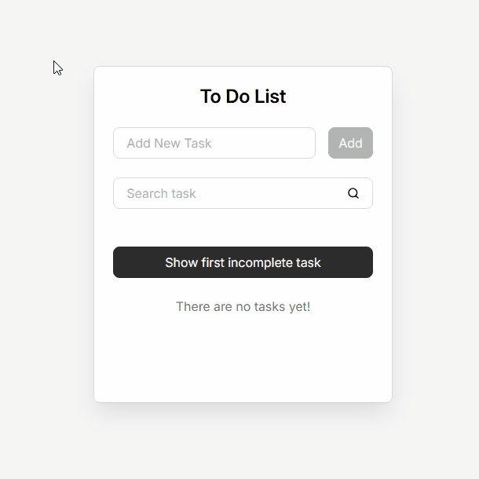

# Пет-проект: Todo List на React

## Демо

[**Открыть проект**](https://kurohador001-lang.github.io/to-do-list_on-react/)

## :book: Описание:

**Todo List** — проект, в котором основной упор был сделан на современные подходы к разработке, масштабируемую архитектуру, разделение ответственности между компонентами и оптимизацию.

## :star2: Реализованный функционал

* :pushpin: Добавление, поиск и удаление задач
* :white_check_mark: Отметка задач как выполненных
* :bar_chart: Отображение общего количества и количества выполненных задач
* :mag: Подсветка совпадений при поиске
* :dart: Прокрутка к первой невыполненной задаче
* :sparkles: Анимации появления и удаления задач
* :world_map: Маршрутизация между списком задач и страницей отдельной задачи
* :floppy_disk: Работа с REST API в режиме разработки и автоматическое переключение на localStorage после деплоя

## :gear: Особенности реализации

* Архитектура по методологии **Feature-Sliced Design (FSD)**
* Компонентный подход
* Использование модульных SCSS-стилей
* Реализация кастомных хуков
* Управление состоянием через useReducer
* Соблюдение принципов Accessibility (a11y)
* Оптимизация производительности с помощью:

  * React.memo
  * useMemo
  * useCallback
  * use-context-selector

## :wrench: Стек технологий в проекте

  * HTML (HTML5)
  * CSS (CSS3), Sass (SCSS), Animations
  * JavaScript (ES6+, OOP)
  * React
  * Vite
  * ESLint, Stylelint, Prettier
  * Feature-Sliced Design, Accessibility, UX
  * Git (GitHub)
  * Figma

## :rocket: Запуск проекта
1. Клонирование репозитория: `git clone`
2. Установка зависимостей: `npm i`
3. Запуск локального сервера: `npm run server`
4. И одновременный запуск самого приложения: `npm run dev`